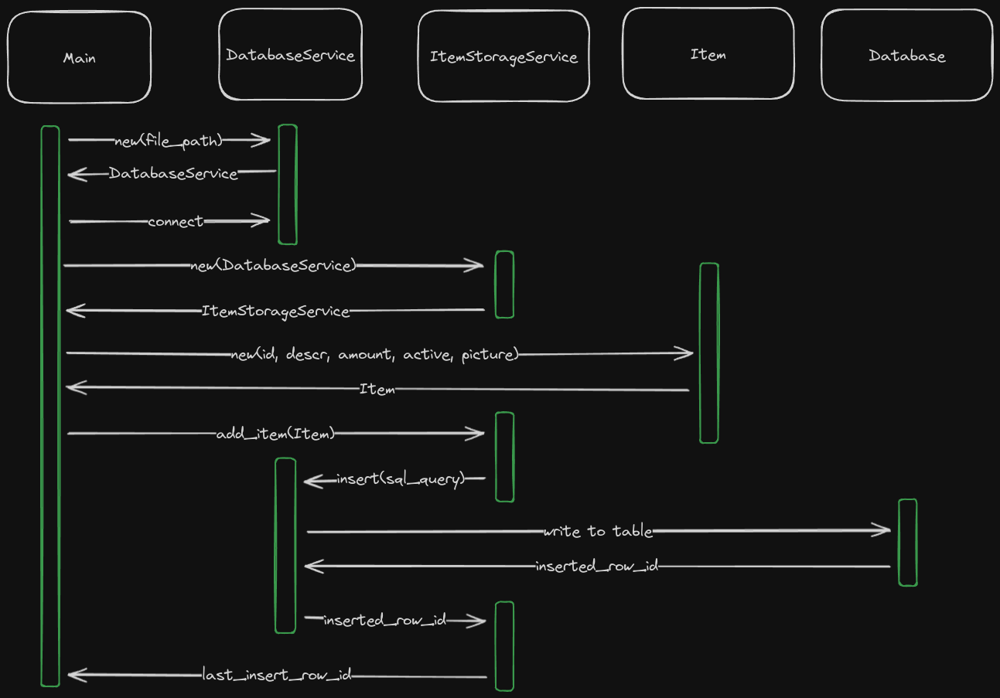

# Rust sqlx Usage Prototype

This is a small prototype to show the usage of sqlx with an SQLite database in Rust.
In this prototype we are working with an Item object.

The Item object is a good example because it has most of the SQLite native types :
INTEGER, TEXT, REAL, BOOLEAN and BLOB.

## Class diagram of the prototype


Note: Item and ItemStorageService structs are present for the example purposes
only and are not needed in your project.

## Sequence diagram of adding an item


## Creating the database to run this prototype

As you will find in the .env file, this prototype is looking for a database
names test.db in the prototype root folder (right beside Cargo.toml).

You first need to run a shell in the prototype root folder and create the test
database with the following command:

```bash
sqlite3 test.db
```

You can then create the database structure by importing the sql migration file:

```bash
.read migrations/initial_db_creation.sql
```

You can confirm that everything went well with the following command :

```bash
.dump
```

You should see this:
```bash
PRAGMA foreign_keys=OFF;
BEGIN TRANSACTION;
CREATE TABLE Item (id INTEGER PRIMARY KEY AUTOINCREMENT,
descr TEXT NOT NULL, amount REAL, active BOOLEAN, picture BLOB);
DELETE FROM sqlite_sequence;
COMMIT;
```

